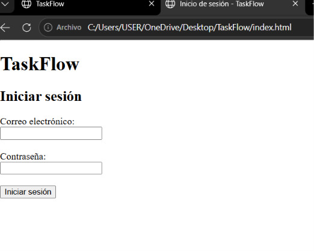
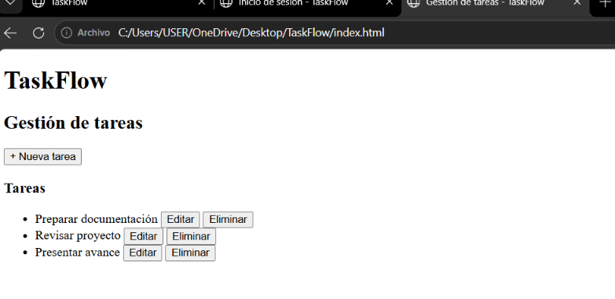

# TaskFlow


## Aplicación para administrar tareas

TaskFlow es una aplicación sencilla para administrar y organizar las tareas de un equipo.

## Funcionalidades

- Registrar tareas
- Editar tareas
- Eliminar tareas
- Asignar tareas a usuarios

## Tecnologías utilizadas

- HTML
- CSS
- JavaScript
- MySQL
- GitHub

## Requisitos

- Computadora
- Navegador web moderno
- Git
- MySQL

## Checklist

- [x] Registrar tareas
- [x] Editar tareas
- [ ] Eliminar tareas
- [ ] Asignar tareas a usuarios

## Tabla de contenidos

- [Descripción](#descripción)
- [Funcionalidades](#funcionalidades)
- [Tecnologías utilizadas](#tecnologías-utilizadas)
- [Requisitos](#requisitos)
- [Instalación](#instalación)
- [Uso](#uso)
- [Capturas de pantalla](#capturas-de-pantalla)
- [Arquitectura](#arquitectura)
- [Estructura del proyecto](#estructura-del-proyecto)
- [Contribuidores](#contribuidores)
- [Licencia](#licencia)

## Instalación

1. Clonar el repositorio.
2. Configurar la base de datos.
3. Configurar las variables necesarias.
4. Ejecutar la aplicación.

## Uso

1. Iniciar la aplicación.
2. Iniciar sesión.
3. Crear una tarea.
4. Editar o eliminar una tarea.

## Capturas de pantalla

### Pantalla principal


### Registro o inicio de sesión



### Pantalla principal de la funcionalidad



### Otra pantalla relevante


## Arquitectura

La aplicación está organizada en diferentes componentes que permiten gestionar la interacción con el usuario, la autenticación, el acceso a datos y el registro de actividades.

```mermaid
flowchart LR
    U[Usuario] --> F[Frontend]
    F --> API[API]
    API --> AUTH[Autenticación]
    API --> DAO[DAO]
    DAO --> DB[(MySQL)]
    API --> LOG[Registro de actividad]
    ´´´
## Estructura del proyecto

```text
TaskFlow/
├── img/
│   ├── inicio.png
│   ├── login.png
│   ├── tareas.png
│   └── otra.png
└── README.md
´´´
## Contribuidores

- Usuario
## Licencia

Este proyecto se desarrolla con fines educativos.